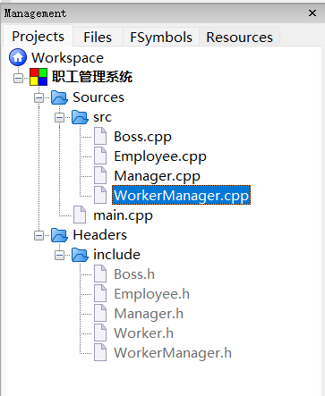
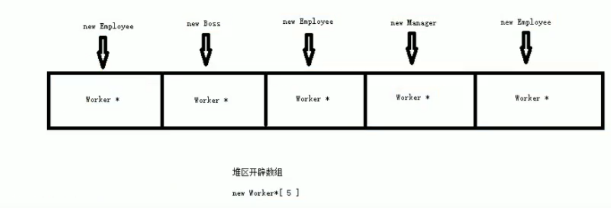
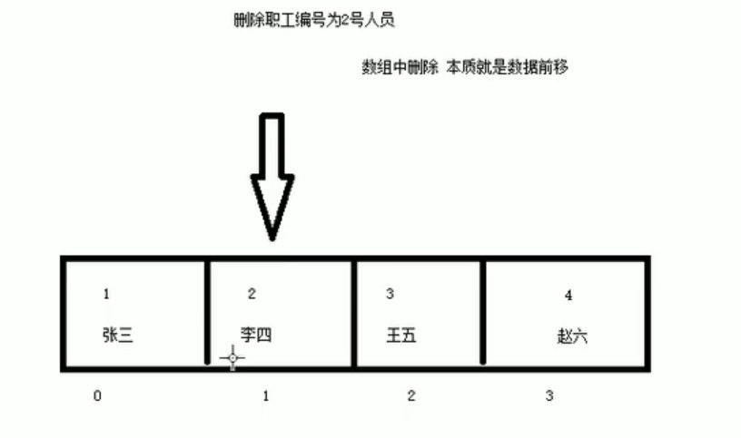

#### 职工管理系统：

职工管理系统可管理公司内所有员工的信息（利用多态特性实现该系统）

公司中职工分为3类：普通员工、经理、老板，显示信息时需要显示职工编号、职工姓名、职工岗位、以及职责

| 岗位     | 职责                                 |
| -------- | ------------------------------------ |
| 普通员工 | 完成经理下发的任务                   |
| 经理     | 接收老板下发的任务，并派给相应的员工 |
| 老板     | 管理公司所有事务                     |

管理系统需要实现的功能：

1. 添加职工信息
2. 删除职工信息
3. 修改职工信息
4. 查找职工信息
5. 显示职工信息：显示公司内部所有职工信息
6. 按照编号排序：按照职工编号进行排序，排序规则由用户指定
7. 清空所有文档：清空文件中记录的所有职工信息（防误删）
8. 退出管理程序

##### 1.创建管理类WorkManager：

管理类的主要职责（功能）包括：

1. 与用户沟通（菜单界面）
1. 对职工信息进行增删改查
1. 对文件的读写交互

创建管理类workerManager，并向其中中添加成员函数`void showMenu();`、以及各个功能的功能类

创建Work抽象类（无具体实现），并创建Employee、Manager、Boss三个子类继承自Work（应用多态）重写实现抽象类Work；

三个子类的创建：分别向子类中添加`showInfo()`、`getDeptName();`以及构造函数`Manager();`



##### 2.添加职工AddEmp：

批量添加职工，并且将数据保存到文件中。

由于动态多态利用<font color='#BAOC2F'>父类指针</font>指向子类对象，如果想要将不同的子类都放到一个数组中，需要将所有<font color='#BAOC2F'>指向子类的父类指针</font>放到一个数组中。

```cpp
worker **Array = new Worker*[5]
```

如果想在程序中维护这个不定长度的数组，需要将数组创建到堆区。（利用`Worker **Array`指针维护）



```cpp
void WorkerManager::AddEmp(){
    cout << "请输出添加职工的数量:" << endl;
    int addNum = 0;
    cin >> addNum;
    if(addNum > 0){
        //1.计算空间的大小(原空间+新增空间)
        int newSize = this->empNum + addNum;
        Worker **newEmpArray = new Worker*[newSize];
        //2.拷贝原空间的数据到新空间中
        if(this->empArray != NULL){
            for(int i = 0; i < this->empNum; ++i){
                newEmpArray[i] = this->empArray[i];
            }
        }
        //3.添加新数据
        for(int i = 0; i < addNum; ++i){
            int id;
            string name;
            int deptSelect;
            cout << "请输入第" << i + 1 << "个新职工编号" << endl;
            cin >> id;
            cout << "请输入第" << i + 1 << "个新职工姓名" << endl;
            cin >> name;
            cout << "请选择该职工的岗位" << endl;
            cout << "1、普通职工" << endl;
            cout << "2、经理" << endl;
            cout << "3、老板" << endl;
            cin >> deptSelect;

            Worker *worker = NULL;
            switch(deptSelect){
            case 1:
                worker = new Employee(id, name, 1);
                break;
            case 2:
                worker = new Manager(id, name, 2);
                break;
            case 3:
                worker = new Boss(id, name, 3);
                break;
            default:
                break;
            }
            //将创建职工的指针，保存到数组中
            newEmpArray[this->empNum + i] = worker;
        }
        //4.释放原有的空间
        delete[] this->empArray;
        //5.更改维护指针数组的指针的指向
        this->empArray = newEmpArray;
        //6.更新职工人数
        this->empNum = newSize;
        //7.将新增&更新的数据保存到文件中
        this->save();
        cout << "成功添加数据" << endl;
    }else{
        cout << "输入数据有误" << endl;
    }
    system("pause");
    system("cls");
}
```

##### 3.将内存中的数据写入文件：

```cpp
void WorkerManager::save(){
    ofstream ofs;
    //1.用输出的方式打开文件
    ofs.open(FILENAME, ios::out);
    //2.将每个人的数据写入到文件中
    for(int i = 0; i < this->empNum; ++i){
        ofs << this->empArray[i]->id << " " << this->empArray[i]->name << " " << this->empArray[i]->deptId << endl;
    }
    //3.关闭文件
    ofs.close();
}
```

##### 4.从文件中将数据读取到内存：

显示录入的职工数据，首先需要将文件中的数据读取到程序中，

每次打开运行程序，读文件可以分为3中情况：

1. 第一次使用程序，没有创建任何文件
2. 文件已经被创建，但是文件中保存的数据被用户清空
3. 文件已经被创建，并且保存了职工的所有数据（需要将文件中的数据转换为程序中的数据）

在WorkManager类的构造函数中，根据情况不同进行修改：

```cpp
WorkerManager::WorkerManager(){
    //1.文件不存在
    ifstream ifs;
    ifs.open(FILENAME, ios::in);
    if(!ifs.is_open()){
        cout << "文件不存在" << endl;
        this->empNum = 0;
        this->empArray = NULL;
        this->fileIsEmpty = true;
        ifs.close();
        return;
    }
    //2.文件存在但是数据为空
    char c;
    ifs >> c;//向后读取一个字符判断是否为end of file
    if(ifs.eof()){
        cout << "文件为空" << endl;
        this->empNum = 0;
        this->empArray = NULL;
        this->fileIsEmpty = true;
        ifs.close();
        return;
    }
    //3.文件存在且不为空存在数据
    //(1)统计文件中的人数
    int num = this->getEmpNum();
    this->empNum = num;
    cout << "职工的人数为:" << num << endl;
    //(2)开辟内存空间，将文件中的数据存到数组中
    this->empArray = new Worker*[this->empNum];
    this->initEmp();
    //(3)输出从文件中读取到的数据
    for(int i = 0; i < this->empNum; ++i){
        cout << "职工编号：" << this->empArray[i]->id << "姓名：" << this->empArray[i]->name << "部门编号：" << this->empArray[i]->deptId << endl;
    }
}
```

```cpp
int WorkerManager::getEmpNum(){
    ifstream ifs;
    ifs.open(FILENAME, ios::in);
    int id;
    string name;
    int deptId;
    int num = 0;
    while(ifs >> id && ifs >> name && ifs >> deptId){
        num ++;
    }
    return num;
}

void WorkerManager::initEmp(){
    ifstream ifs;
    ifs.open(FILENAME, ios::in);
    int id;
    string name;
    int deptId;

    int index = 0;
    while(ifs >> id && ifs >> name && ifs >> deptId){
        Worker *worker = NULL;
        if(deptId == 1){
            worker = new Employee(id, name, deptId);
        }else if(deptId == 2){
            worker = new Manager(id, name, deptId);
        }else{
            worker = new Boss(id, name, deptId);
        }
        this->empArray[index] = worker;
        index++;
    }
    ifs.close();
}
```

##### 5.显示职工showEmp：

```cpp
void WorkerManager::showEmp(){
    if(this->fileIsEmpty){
        cout << "文件不存在或者记录为空" << endl;
    }else{
        for(int i = 0; i < empNum; ++i){
            //由于子类不同，利用多态调用程序接口
            this->empArray[i]->showInfo();
        }
    }
    system("pause");
    system("cls");
}
```

##### 6.删除职工deleteEmp：



```cpp
void WorkerManager::deleteEmp(){
    if(this->fileIsEmpty){
        cout << "文件不存在或记录为空！" << endl;
    }else{
        cout << "请输入想要删除职工的编号：" << endl;
        int id;
        cin >> id;
        int index = this->isExist(id);
        if(index != -1){
            //1.进行删除操作(数据前移)
            for(int i = index; i < this->empNum - 1; ++i){
                this->empArray[i] = this->empArray[i + 1];
            }
            //2.更新数组中记录人员的个数
            this->empNum--;
            //3.将内存中更新后的数据同步到文件中
            this->save();
            cout << "删除成功！" << endl;
        }else{
            cout << "删除失败，未找到该职工！" << endl;
        }
    }
    system("pause");
    system("cls");
}

int WorkerManager::isExist(int id){
    int index = -1;
    for(int i = 0; i < this->empNum; ++i){
        if(this->empArray[i]->id == id){
            index = i;
            break;
        }
    }
    return index;
}
```

##### 7.修改职工updateEmp：

```cpp
void WorkerManager::updateEmp(){
    if(this->fileIsEmpty){
        cout << "文件不存在或记录为空!" << endl;
    }else{
        cout << "请输入修改职工的编号:" << endl;
        int id;
        cin >> id;
        int index = this->isExist(id);
        if(index != -1){
            //1.删除原数据
            delete this->empArray[index];
            //2.根据输入新数据创建对应的子类对象
            int newId = 0;
            string newName = "";
            int newDeptId = 0;
            cout << "查找到" << id << "号职工" << endl;
            cout << "请输入新的职工号：";
            cin >> newId;
            cout << "请输入新的姓名：";
            cin >> newName;
            cout << "1.普通职工" << endl;
            cout << "2.经理" << endl;
            cout << "3.老板" << endl;
            cout << "请输入岗位：";
            cin >> newDeptId;

            Worker *worker = NULL;
            switch(newDeptId){
            case 1:
                worker = new Employee(newId, newName, newDeptId);
                break;
            case 2:
                worker = new Manager(newId, newName, newDeptId);
                break;
            case 3:
                worker = new Boss(newId, newName, newDeptId);
                break;
            default:
                break;
            }
            //3.将新数据插入到数组中
            this->empArray[index] = worker;
            //4.将内存中修改后的数据同步到文件中
            this->save();
            cout << "修改成功!" << endl;
        }else{
            cout << "查无此人" << endl;
        }
    }
    system("pause");
    system("cls");
}
```

##### 8.查找职工findEmp：

```cpp
void WorkerManager::findEmp(){
    if(this->fileIsEmpty){
        cout << "文件不存在或记录为空！" << endl;
    }else{
        cout << "1.按职工编号查找" << endl;
        cout << "2.按职工姓名查找" << endl;
        cout << "请输入查找的方式：";
        int select;
        cin >> select;
        if(select == 1){
            //(1)按照编号进行职工查询
            int id;
            cout << "请输入查找的职工编号：";
            cin >> id;
            int index = isExist(id);
            if(index != -1){
                cout << "查找成功！该职工的信息如下：" << endl;
                this->empArray[index]->showInfo();
            }else{
                cout << "查无此人" << endl;
            }
        }else if(select == 2){
            //(2)按照姓名进行职工查询
            bool flag = false;
            string dname;
            cout << "请输入查找的姓名：";
            cin >> dname;
            for(int i = 0; i < empNum; ++i){
                if(this->empArray[i]->name == dname){
                    cout << "查找成功,职工编号为" << this->empArray[i]->id << "号职工信息如下：" << endl;
                    this->empArray[i]->showInfo();
                    flag = true;
                }
            }
            if(flag == false){
                cout << "查找失败，查无此人" << endl;
            }
        }else{
            cout << "输入选项有误!" << endl;
        }
    }
    system("pause");
    system("cls");
}
```

##### 9.排序：

利用<font color='#BAOC2F'>选择排序</font>、按照职工编号进行排序，排序的顺序由用户自定：

```cpp
void WorkerManager::sortEmp(){
    if(this->fileIsEmpty){
        cout << "文件不存在或记录为空" << endl;
        system("pause");
        system("cls");
    }else{
        int select = 0;
        cout << "1.按照职工号进行升序排列" << endl;
        cout << "2.按照职工号进行降序排列" << endl;
        cout << "请选择排序的方式：";
        cin >> select;
        //1.选择排序
        for(int i = 0; i < this->empNum; ++i){
            //(1)声明最小值or最大值下标
            int minOrMax = i;
            //(2)遍历数组尝试更新minOrMax
            for(int j = i + 1; j < this->empNum; ++j){
                if(select == 1){
                    if(this->empArray[minOrMax]->id > this->empArray[j]->id) minOrMax = j;//升序排列
                }else if(select == 2){
                    if(this->empArray[minOrMax]->id < this->empArray[j]->id) minOrMax = j;//降序排列
                }else{
                    cout << "输入错误" << endl;
                }
            }
            //(3)判定最初认定的minOrMax是不是计算的最大值or最小值(即minOrMax是否更新)，如果不是则交换i与minOrMax的数据
            if(i != minOrMax){
                Worker *temp = this->empArray[i];
                this->empArray[i] = this->empArray[minOrMax];
                this->empArray[minOrMax] = temp;
            }
        }
        //2.将内存中的排序结果同步到文件中
        this->save();
        //3.输入排序结果
        cout << "排序成功！排序后的结果为：" << endl;
        this->showEmp();
    }
}
```

##### 10.清空文件：

开辟在堆区内存的数据需要全部释放，关于析构函数的改进：

```cpp
WorkerManager::~WorkerManager(){
    if(this->empArray != NULL){
        //1.将数组中的每一个元素置空
        for(int i = 0; i < this->empNum; ++i){
            if(this->empArray[i] != NULL) delete this->empArray[i];
        }
        //2.然后再将数组置空
        delete[] this->empArray;
        this->empArray = NULL;
    }
}
```

```cpp
void WorkerManager::clearFile(){
    int select = 0;
    cout << "确定清空？" << endl;
    cout << "1.清空" << endl;
    cout << "2.返回" << endl;
    cin >> select;

    if(select == 1){
        ofstream ofs(FILENAME, ios::trunc);//删除文件后再重新创建
        ofs.close();
        if(this->empArray != NULL){
            //1.删除创建在堆区的每个对象，并将指针置空
            for(int i = 0; i < this->empNum; ++i){
                delete this->empArray[i];
                this->empArray[i] = NULL;
            }
            //2.删除堆区的数组指针
            delete[] this->empArray;
            this->empArray = NULL;
            //3.数据初始化
            this->empNum = 0;
            this->fileIsEmpty = true;
        }
        cout << "清空成功！" << endl;
    }
    system("pause");
    system("cls");
}
```


